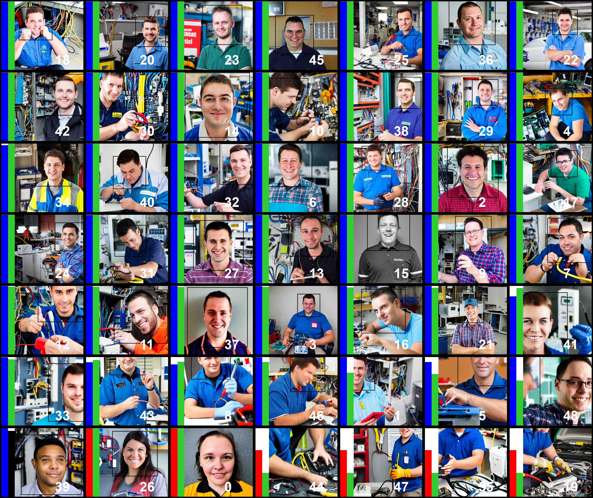
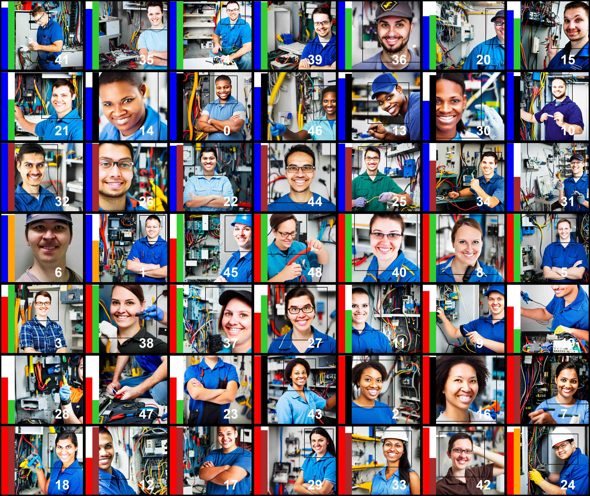

# Finetuning Text-to-Image Diffusion Models for Fairness
Code and checkpoints for the paper [Finetuning Text-to-Image Diffusion Models for Fairness](https://openreview.net/forum?id=hnrB5YHoYu) (ICLR 2024, oral presentation).

<div align="center">
  
  
  <div style="clear: both;"></div>
</div> 
<p align="center"><em>Prompt: "A photo of the face of a electrical and electronics repairer, a person". Left images are generated by the original stable-diffusion-v1-5. Right images are generated by the finetuned stable diffusion, debiased for gender and race jointly. For every image, the first color-coded bar denotes the predicted gender: male (<span style="color: blue;">blue</span>) or female (<span style="color: red;">red</span>). The second denotes race: WMELH (<span style="color: green;">green</span>), Asian (<span style="color: orange;">orange</span>), Black (<span style="color: black;">black</span>), or Indian (<span style="color: brown;">brown</span>). WMELH is the broad race class of White, Middle Eastern, and Latino Hispanic. Bar height represents prediction confidence. Bounding boxes denote detected faces. Images with the same number label are generated using the same noise.</em></p>

## Prerequisite:
This project has been tested under the following environment:
- OS: Red Hat Enterprise Linux 8.4
- GPU: NVIDIA A100-SXM4-40GB ($\times$ 2, or more)
- CUDA Version: 12.2

1. We manage environments with Conda. To set up the environment, follow these steps:
```
conda env create -f environment.yml
conda activate fair-diffusion
```

2. To set up wandb for logging, run:
```
wandb login
```

3. Download data.zip from this [link](https://drive.google.com/file/d/18FAu5rxGC2AlC3IN43lukE6Rgyyff3AR/view?usp=share_link) to the working directory, unzip it by:
```
unzip data.zip
```
This will create a data folder in the current working directory.


## Experiments:
This repository includes the code and checkpoints necessary to replicate the five experiments detailed in our paper. To find more information on a specific experiment, please click on the experiment's name, which will direct you to the corresponding folder.
| Experiment Name | Prompts | Description |
|------------|---|-----------------|
| [exp-1-debias-gender](exp-1-debias-gender/) | Occupations | Finetune LoRA on text encoder and/or U-Net to debias binary gender to a perfectly balanced distribtion. |
| [exp-2-debias-gender-token](exp-2-debias-gender-token/) | Occupations | Finetune prompt prefix to debias binary gender to a perfectly balanced distribtion. |
| [exp-3-debias-gender-race](exp-3-debias-gender-race) | Occupations | Finetune LoRA on text encoder and/or U-Net to jointly debias binary gender and four classes of race, to a perfectly balanced distribtion. |
| [exp-4-debias-gender-race-age](exp-4-debias-gender-race-age) | Occupations | Finetune LoRA on text encoder and/or U-Net to jointly debias binary gender and four classes of race, to a perfectly balanced distribtion. Simultaneouly, control age to 75% yound and 25% old distribution. |
| [exp-5-debias-gender-race-multi-concepts](exp-5-debias-gender-race-multi-concepts) | (1) Occupations, (2) occupations with style and context, (3) personal descriptors, and (4) sports  | Finetune LoRA on text encoder and/or U-Net to jointly debias binary gender and four classes of race, to a perfectly balanced distribtion. |
| [exp-6-debias-race](exp-6-debias-race) | Occupations  | Finetune LoRA on text encoder and/or U-Net to debias four classes of race, to a perfectly balanced distribtion. |


## Fair diffusion model adaptors
If you're primarily interested in utilizing and evaluating our debiased Stable Diffusion v1-5, please follow below instructions.


| Experiment Name | Checkpoints | Instructions on how to use |
|------------|---|-----------------|
| [exp-1-debias-gender](exp-1-debias-gender/) | [link](https://drive.google.com/file/d/1G6sl8Hv8ZX1poaqTHiBGDdz1Sqj1bs4u/view?usp=share_link) | unzip to `exp-1-debias-gender/outputs`, follow instructions starting from [this point onwards](exp-1-debias-gender/README.md#step-3). |
| [exp-2-debias-gender-token](exp-2-debias-gender-token/) | [link](https://drive.google.com/file/d/1jRgL5hCxeME5q2FOMUOmKbiGh0awKMq8/view?usp=share_link) | unzip to `exp-2-debias-gender-token/outputs`, follow instructions starting from [this point onwards](exp-2-debias-gender-token/README.md#step-3). |
| [exp-3-debias-gender-race](exp-3-debias-gender-race) | [link](https://drive.google.com/file/d/1aYCBNnIJlj3nrIYd8o-D4ob02JLVQnpk/view?usp=share_link) | unzip to `exp-3-debias-gender-race/outputs`, follow instructions starting from [this point onwards](exp-3-debias-gender-race/README.md#step-3). |
| [exp-4-debias-gender-race-age](exp-4-debias-gender-race-age) | [link](https://drive.google.com/file/d/1KSd3BE67xq3LONH7rcBk6c0qEvQlRhDQ/view?usp=share_link) | unzip to `exp-4-debias-gender-race-age/outputs`, follow instructions starting from [this point onwards](exp-4-debias-gender-race-age/README.md#step-3). |
| [exp-5-debias-gender-race-multi-concepts](exp-5-debias-gender-race-multi-concepts) | [link](https://drive.google.com/file/d/1oV5WBl8DKFEHrI4fzBJLekK1GPyNKRpF/view?usp=share_link) | unzip to `exp-5-debias-gender-race-multi-concepts/outputs`, follow instructions starting from [this point onwards](exp-5-debias-gender-race-multi-concepts/README.md#step-3). |
| [exp-6-debias-race](exp-6-debias-race) | [link](https://drive.google.com/file/d/1u1zy3Q4dINYU17YK3ckB3lMyrKe_20LA/view?usp=share_link) | unzip to `exp-6-debias-race/outputs`, follow instructions starting from [this point onwards](exp-6-debias-race/README.md#step-3). |


# Get in touch
We sincerely appreciate your interest in our work. Should you have any questions, please don't hesitate to reach out to Xudong at xudong.shen@u.nus.edu.

# Citation

```
@inproceedings{shen2024finetuning,
      title={Finetuning Text-to-Image Diffusion Models for Fairness}, 
      author={Xudong Shen and Chao Du and Tianyu Pang and Min Lin and Yongkang Wong and Mohan Kankanhalli},
      booktitle={The Twelfth International Conference on Learning Representations},
      year={2024},
      url={https://openreview.net/forum?id=hnrB5YHoYu}
}
```
