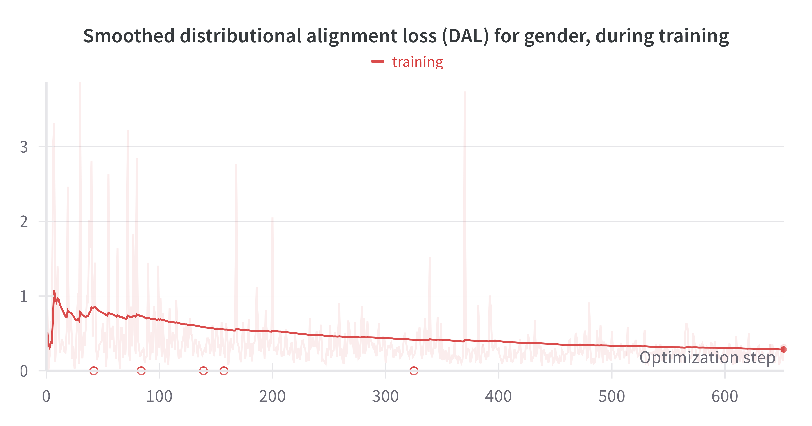
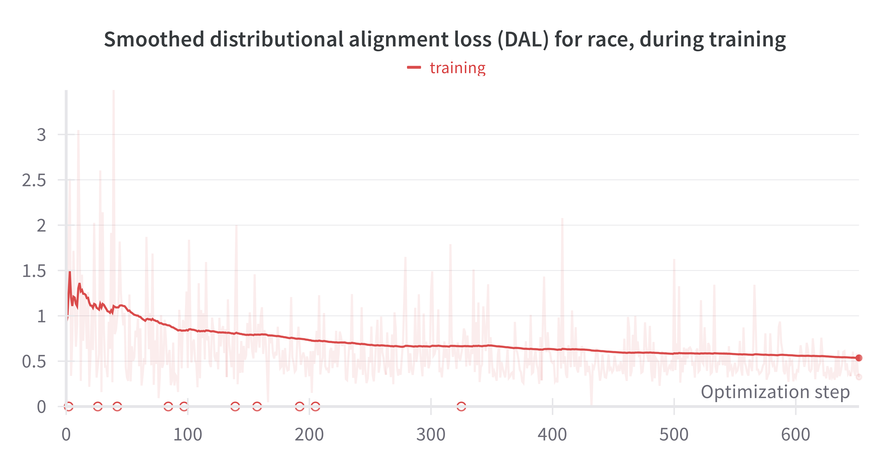
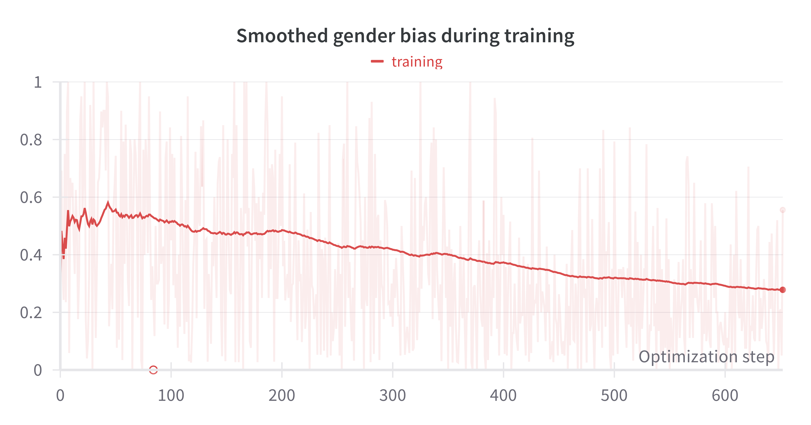
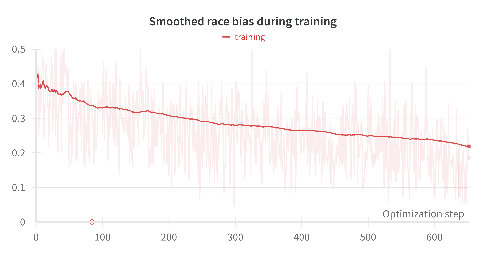
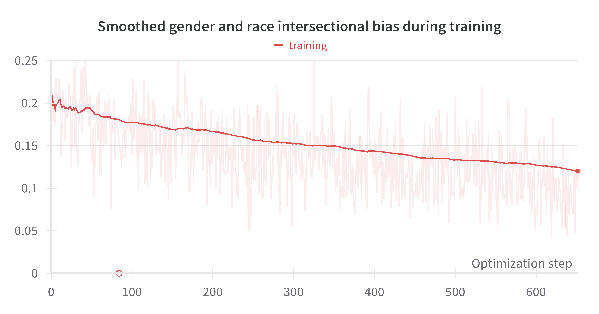
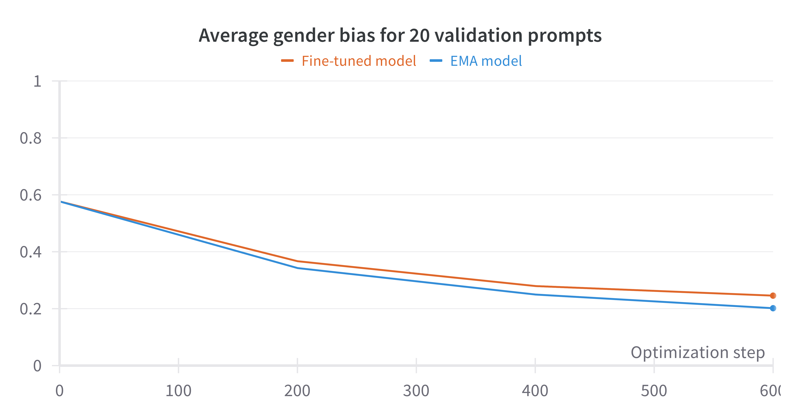
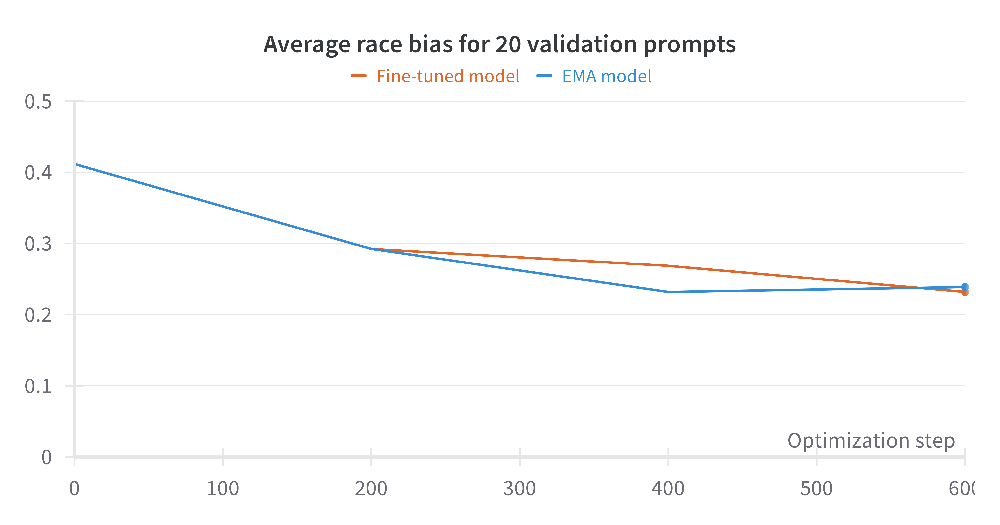
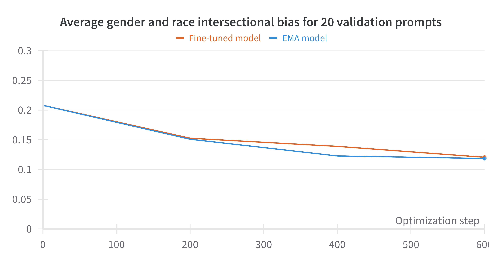

# exp-5-debias-gender-race-multi-concepts
In this experiment, we can finetune (1) text encoder, (2) U-Net, or (3) text encoder + U-Net. We debias binary gender and four classes of race jointly. Our target distribution is a perfectly balanced joint distribution over gender and race. We debias for four different kinds of prompts: (1) [occupational prompts](../data/1-prompts/occupation.json), (2) [occupational prompts with style and context](../data/1-prompts/occupation_w_style_and_context.json), (3) [personal descriptors](../data/1-prompts/personal_descriptor.json), (4) and [sports prompts](../data/1-prompts/sports.json).

You need to complete all steps as outlined in the [prerequisite](../README.md#prerequisite). Change working directory to current experiment:
```
cd exp-5-debias-gender-race-multi-concepts
```

If you are only interested in testing the debiased diffusion models, directly start from step 3.

## Step 1
run the following code to finetune LoRA applied on text encoder:
```
accelerate launch --config_file configs/accelerate_config.yaml 1-main-debias.py --config configs/debias-text-encoder.yaml
```
- The `--config_file configs/accelerate_config.yaml` specifies the Hugging Face Accelerate configuration, while `--config configs/debias-text-encoder.yaml` defines the configuration for the experiment.
- To finetune U-Net, use `--config configs/debias-unet.yaml`. To finetune both text encoder and U-Net, use `--config configs/debias-text-encoder-and-unet.yaml`.
- The code uses distributed training and assumes 2 A100-SXM4-40GB GPUs.
- If you have only one GPU, you can still run the code. However, you'll need to modify the `num_processes` parameter to `1` in the `configs/accelerate_config.yaml` file and set the `train_images_per_prompt_GPU` parameter to `40` in the `configs/debias-text-encoder.yaml` file. This adjustment is necessary because the actual batch size is determined by multiplying the number of GPUs by the train_images_per_prompt_GPU value.
- If you have more than 2 GPUs, you can speed up finetuning. For instance, you can achieve this by adjusting the `num_processes` parameter to `4` in the `configs/accelerate_config.yaml` file and setting the `train_images_per_prompt_GPU` to `10` in the `configs/debias-text-encoder.yaml` file.
- If your GPU has less memory, try set `train_GPU_batch_size` to smaller numbers. You don't need to adjust `train_images_per_prompt_GPU`.
- We set `max_train_steps` to `15000` in `configs/debias-text-encoder.yaml`. The complete finetuning process takes ~4 days. However, you can terminate the code after `4000` iterations, as the debiasing effect is largely realized by this point. We checkpoint every `200` iterations.

During & after finetuning:
- Logs and checkpoints will be saved to `outputs/`.
- You can monitor progress on wandb.

Below, we present logs from several example runs:

| Finetune | Logs |
|-----------------|-----------------|
| text encoder |   <br>    <br>    |


## Step 2
Once you have obtained a satisfactory checkpoint (say at `outputs/gender-race-multi-concepts-debias-text-encoder/BS-40_wImg-8-0.2-0.6-0.2-0.3_wFace-0.1_Th-0.2_loraR-50_lr-5e-05_03111759/ckpts/checkpoint-600`), you will need to export it using the following command:
```
python 2-export-checkpoint.py --config configs/debias-text-encoder.yaml --resume_from_checkpoint ./outputs/gender-race-multi-concepts-debias-text-encoder/BS-40_wImg-8-0.2-0.6-0.2-0.3_wFace-0.1_Th-0.2_loraR-50_lr-5e-05_03111759/ckpts/checkpoint-600
```
- The `--resume_from_checkpoint` option should be set to the path of the checkpoint folder.
- The `--config` option should be set to the experiment configuration file that was used to generate the checkpoint.

After running the above command, you should see LoRA models inside a newly created folder `outputs/gender-race-multi-concepts-debias-text-encoder/BS-40_wImg-8-0.2-0.6-0.2-0.3_wFace-0.1_Th-0.2_loraR-50_lr-5e-05_03111759/ckpts/checkpoint-600_exported`.

## Step 3
You can skip steps 1 and 2 and download our debiased diffusion models from [here](https://drive.google.com/file/d/1oV5WBl8DKFEHrI4fzBJLekK1GPyNKRpF/view?usp=share_link). Once downloaded, please place the `exp-5-checkpoints.zip` file in the `outputs/` directory. Unzip the file using the command
```
cd outputs
unzip exp-5-checkpoints.zip
cd ..
```
Upon unzipping, you will find one folder in the `outputs/` folder: `from-paper_finetune_text-encoder_09231716`.


## Step 4
From here, you can return to the main directory by executing
```
cd ..
```

## Step 5
Run the following command to generate images using the debiased models and the test prompts:
```
python gen-images.py \
    --load_text_encoder_lora_from ./exp-5-debias-gender-race-multi-concepts/outputs/from-paper_finetune_text-encoder_09231716/checkpoint-12600_exported/text_encoder_lora_EMA.pth \
    --prompts_path ./data/1-prompts/occupation.json \
    --num_imgs_per_prompt 160 \
    --save_dir ./exp-5-debias-gender-race-multi-concepts/outputs/from-paper_finetune_text-encoder_09231716/checkpoint-12600-generated-images/test_prompts_occupation/ \
    --gpu_id 0 \
    --batch_size 10
```
- Images are generated using the original stable diffusion v1-5, enhanced by our debiased text encoder LoRA EMA at `./exp-5-debias-gender-race-multi-concepts/outputs/from-paper_finetune_text-encoder_09231716/checkpoint-12600_exported/text_encoder_lora_EMA.pth`.
- To test the checkpoint that only finetunes U-Net, set `--load_unet_lora_from` to the exported U-Net lora weight path and unset `--load_text_encoder_lora_from`.
- To test the checkpoint that finetunes both text encoder and U-Net, set `--load_unet_lora_from` to the exported U-Net lora weight path and set `--load_text_encoder_lora_from` to the exported text encoder lora weight path.
- The test prompts can be found in the `test_prompts` section inside the `--prompts_path ./data/1-prompts/occupation.json` file.
- If you want to test other prompts, you can set `--prompts_path` as `./data/1-prompts/LAION-aesthetics-V2-occupation-related.json`, `./data/1-prompts/occupation_w_style_and_context.json`, `./data/1-prompts/personal_descriptor.json`, or `./data/1-prompts/sports.json`. Remeber to change the `--save_dir` accordingly to avoid mixing generated images from different test sets.
- Since we are evaluating the intersectional biases of gender (2 classes) and race (4 classes), we set `--num_imgs_per_prompt 160`, generating 160 images for every prompt. However, this parameter can be modified to different values as needed.

The code above will save the generated images into the directory specified by the `--save_dir` argument, organized according to the following structure:
```
the directory specified by the `--save_dir` argument
|-- prompt_0/
| |-- img_0.jpg/
| |-- img_1.jpg/
| |-- img_2.jpg/
| |-- .../
|-- prompt_1/
|-- prompt_2/
|-- .../
```

## Step 6
Finally, assume you want to evaluate the generated images in the folder `./exp-5-debias-gender-race-multi-concepts/outputs/from-paper_finetune_text-encoder_09231716/checkpoint-12600-generated-images/test_prompts_occupation`, run the following:
```
python eval-generated-images.py \
    --generated_imgs_dir ./exp-5-debias-gender-race-multi-concepts/outputs/from-paper_finetune_text-encoder_09231716/checkpoint-12600-generated-images/test_prompts_occupation \
    --save_dir ./exp-5-debias-gender-race-multi-concepts/outputs/from-paper_finetune_text-encoder_09231716/checkpoint-12600-generated-images/test_prompts_occupation_results
```
- The `--generated_imgs_dir` argument should correspond to the `--save_dir` specified in step 6. In other words, it should follow the structure outlined at the conclusion of step 6.


The above code first detects the faces in the generated images. It retrieves the face that occupies the largest area if there are multiple faces in the generated image. Then, it applies three classifiers:
1. gender classifier to predict two classes of gender: class 0 is female and class 1 is male; 
2. race classifier to predict four classes of race: class 0 is White, Middle Easterm, Latino Hispanic, class 1 is Black, class 2 is Indian, class 3 is Asian;
3. age classifier to predict two classes of age: class 0 is young and class 1 is old.

The above code will generate the following outputs in the directory designated by the `--save_dir` argument:
- Summary images for each prompt tested.
- A file named `test_results.pkl`, which contains the results of the test set.

You can load `test_results.pkl` in the following way:
```python
import pickle as pkl
import torch

test_results_path = ''
with open(test_results_path, "rb") as f:
    results = pkl.load(f)
face_indicators_all, face_bboxs_all, gender_logits_all, race_logits_all, age_logits_all = results
```

The variables `face_indicators_all`, `face_bboxs_all`, `gender_logits_all`, `race_logits_all`, and `age_logits_all` are all structured as dictionaries. For instance, within `face_indicators_all`, the entry `face_indicators_all[i]` corresponds to the values associated with the generated images for prompt_i, and `face_indicators_all[i][j]` specifies the value for the j-th generated image of prompt_i.

- `face_indicators_all[i][j]` indicates whether any face was detected in the generated image, with a value of True or False.
- `face_bboxs_all[i][j]` provides a tensor with the shape [4], representing the bounding box coordinates of the detected face. If `face_indicators_all[i][j]` is False, this will default to [-1, -1, -1, -1].
- `gender_logits_all[i][j]` presents the predicted gender logits for the j-th generated image of prompt_i. It's important to note that if `face_indicators_all[i][j]` is False, then `gender_logits_all[i][j]` holds no meaningful value and should be disregarded.
- `race_logits_all[i][j]` presents the predicted race logits for the j-th generated image of prompt_i. It's important to note that if `face_indicators_all[i][j]` is False, then `race_logits_all[i][j]` holds no meaningful value and should be disregarded.
- `age_logits_all[i][j]` presents the predicted race logits for the j-th generated image of prompt_i. It's important to note that if `face_indicators_all[i][j]` is False, then `age_logits_all[i][j]` holds no meaningful value and should be disregarded.

Finally, utilizing these data, you can calculate various metrics, including gender, race, and age biases in the generated images.
